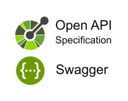

## Spring Boot, H2 Database, CRUD and Swagger

### 1. Maven Clean:
```bash
mvn clean
```

### 2. Maven Install:
```bash
mvn install
```

### 3. Run Maven and Spring Boot application:
```bash  
mvn spring-boot:run
```

### 4. To stop the execution, just run the command in the terminal:
```bash
CTRL + C 
```
---



#### See the document Springdoc: [Migrating from SpringFox](https://springdoc.org/migrating-from-springfox.html)

#### Document Swagger - OpenAPI `OAS 3.0`.

- **URL SWAGGER-UI:**

```http://localhost:8080/swagger-ui/index.html```

`JSON`

#### Swagger:
```json
{  
"nome": "Swagger",  
"dataNascimento": "dd/MM/yyyy",  
"cpf": "01"
}
```
#### OpenAPI:
```json
{  
"nome": "name",  
"dataNascimento": "dd/MM/yyyy",  
"cpf": "01",  
    "produtos": [
        {
            "quantidade": 10,
            "item": "item",
            "marca": "marca"
        }
    ]
}
```
---

### Postman  :rocket:

- **URL:**

``` 
http://localhost:8080/user
http://localhost:8080/produtos
```
- **PATCH:**
```bash 
/id for GET, PUT, or DELETE 
```

### Headers:

- **Key:** Content-Type

- **Value:** application/json

### Body:
- **raw**
- **JSON**

### HTTP Methods, CRUD and Status:
:rocket: [What are Http methods?](https://developer.mozilla.org/en-US/docs/Web/HTTP/Methods)

:rocket: [What is CRUD?](https://www.codecademy.com/article/what-is-crud)

:rocket: [HTTP response status code](https://developer.mozilla.org/en-US/docs/Web/HTTP/Status)

|    HTTP    |  CRUD  | STATUS                  |
|:----------:|:------:|:------------------------|
|  GET ALL   |  READ  | 200 OK                  | 
|   GET ID   |  READ  | 200 OK                  |
|    POST    | CREATE | 201 Created             |
|    PUT     | UPDATE | 200 OK                  |
| DELETE ID  | DELETE | 200 OK / 204 No Content |
| DELETE ALL | DELETE | 200 OK / 204 No Content |